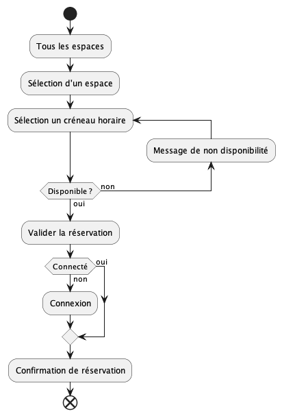
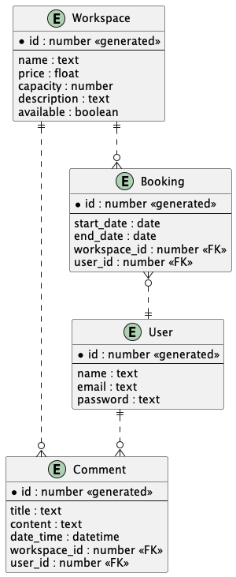

# Cahier des Charges Fonctionnel (CDCF)

## Présentation du Projet

Le projet consiste à créer une application web pour la gestion des espaces de coworking. Cette application permettra aux utilisateurs de visualiser la liste des espaces de coworking, voir les détails d'un espace spécifique, y compris les commentaires des autres utilisateurs, ajouter leurs propres commentaires, vérifier la disponibilité d'un espace et effectuer une réservation.

## Besoins et Objectifs

**Besoins Identifiés :**

- Les utilisateurs ont besoin d'un moyen simple et efficace pour trouver des espaces de coworking.
- Les utilisateurs ont besoin de voir les détails d'un espace de coworking, y compris les commentaires des autres utilisateurs.
- Les utilisateurs ont besoin de pouvoir ajouter leurs propres commentaires sur un espace de coworking.
- Les utilisateurs ont besoin de vérifier la disponibilité d'un espace de coworking.
- Les utilisateurs ont besoin de pouvoir réserver un espace de coworking.

**Objectifs du Projet :**

- Fournir une interface utilisateur simple et intuitive.
- Permettre aux utilisateurs de visualiser la liste des espaces de coworking.
- Permettre aux utilisateurs de voir les détails d'un espace de coworking, y compris les commentaires des autres utilisateurs.
- Permettre aux utilisateurs d'ajouter leurs propres commentaires sur un espace de coworking.
- Permettre aux utilisateurs de vérifier la disponibilité d'un espace de coworking.
- Permettre aux utilisateurs de réserver un espace de coworking.

## Fonctionnalités du Projet

**Spécifications Fonctionnelles :**

1. **Visualiser la Liste des Espaces de Coworking :**
   - Les utilisateurs peuvent visualiser une liste de tous les espaces de coworking disponibles.
2. **Voir les Détails d'un Espace de Coworking :**
   - Les utilisateurs peuvent sélectionner un espace de coworking spécifique pour voir plus de détails, y compris les commentaires des autres utilisateurs.
3. **Ajouter un Commentaire :**
   - Les utilisateurs peuvent ajouter leurs propres commentaires sur un espace de coworking spécifique.
4. **Vérifier la Disponibilité d'un Espace de Coworking :**
   - Les utilisateurs peuvent vérifier la disponibilité d'un espace de coworking spécifique.
5. **Réserver un Espace de Coworking :**
   - Les utilisateurs peuvent réserver un espace de coworking spécifique.

**MVP (Minimum Viable Product) :**

- Le MVP de ce projet comprendra les fonctionnalités suivantes :
  1.  Visualiser la liste des espaces de coworking.
  2.  Voir les détails d'un espace de coworking, y compris les commentaires des autres utilisateurs.
  3.  La possibilité de créer un compte et de s'authentifier.
  4.  Ajouter un commentaire sur un espace de coworking.
  5.  Vérifier la disponibilité d'un espace de coworking.
  6.  Réserver un espace de coworking.

**Évolutions Potentielles :**

- Les évolutions potentielles du projet qui ne font pas partie du MVP incluent :
  1.  La possibilité pour les utilisateurs de modifier ou de supprimer leurs propres commentaires.
  2.  La possibilité pour les administrateurs de gérer les espaces de coworking, y compris l'ajout, la modification et la suppression d'espaces.
  3.  Possibilité pour les utilisateurs de noter les espaces de coworking.
  4.  Recherche et filtrage des espaces de coworking.

## Cible du Projet

- Le public cible de ce projet sont les professionnels, les freelances et les entreprises qui cherchent à réserver des espaces de coworking.

## Arborescence de l'Application

1. **Page d'Accueil :**
   - Présentation du site.
2. **Page Liste des Coworkings :**
   - Listing des coworkings et de leur descriptif
3. **Page de Détails d'un Espace de Coworking :**
   - Détails de l'espace de coworking sélectionné, y compris les commentaires des autres utilisateurs.

## Liste des User Stories

|En tant que ... | je souhaite pouvoir ... | afin de ... |
|---|---|---|
| Utilisateur | voir la présentation du site | choisir celui que je veux |
| Utilisateur | voir la liste des espaces | choisir celui que je veux |
| Utilisateur | voir les détails d'un espace de coworking (description, photos, équipements, commentaires) | verifier qu'il correspond à ce que je veux |
| Utilisateur | ajouter un commentaire | partager mon experience |
| Utilisateur | vérifier la dispo d'un espace | pouvoir le resevrer après |
| Utilisateur | réserver un espace | pouvoir l'utiliser à une date donnée |
| Utilisateur | créer un compte | pouvoir me connecter |
| Utilisateur | me connecter | avoir accès à la résa et l'ajout de commentaires |

## Use cases

## Diagramme d'activité

## ERD

## UML de la structure dockerisée : docker diagramm

Shema pour representer les containers et leurs liens (images, réseaux, volumes ...)

TODO